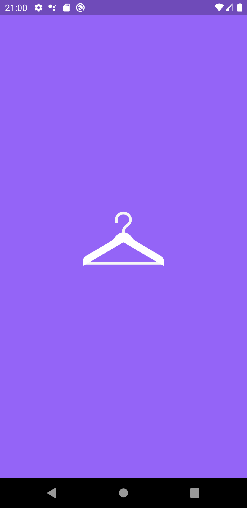
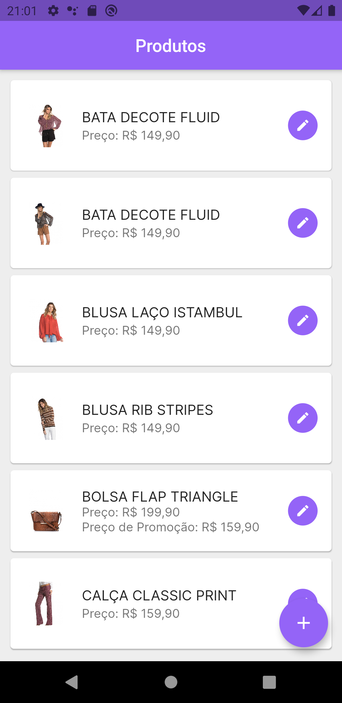
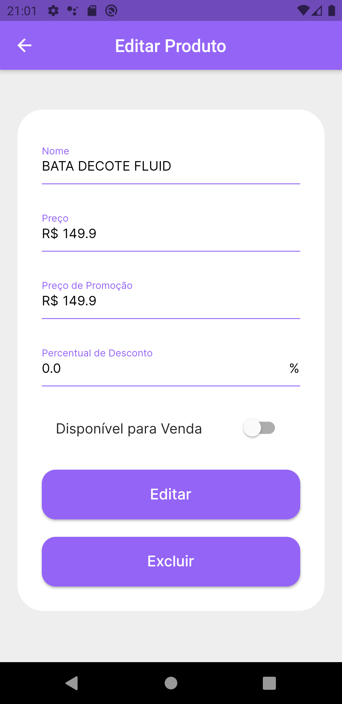
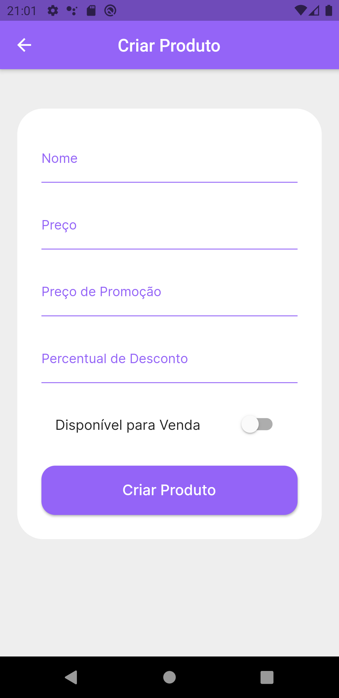

  

<h1 align="center">
  Desafio Confere Software Engineer Mobile
</h1>

## 🧪 Tecnologias

Este desafio foi desenvolvido utilizando as tecnologias:

- [Dart](https://dart.dev)
- [Flutter](https://flutter.dev)
- [BLoC](https://pub.dev/packages/flutter_bloc)
- [DIO](https://pub.dev/packages/dio)
- [SQLITE](https://pub.dev/packages/sqflite)
- [Shared Preferences](https://pub.dev/packages/shared_preferences)

## 💻 Desafio

Este desafio foi desenvolvido de acordo com as especificações do **[Desafio Confere Software Engineer Mobile](https://github.com/confere/vagas/tree/master/desafios/software-engineer-mobile)**

## 📱 APK

**[APK](https://drive.google.com/file/d/1QcfDiRABjri-Oy-ezkoGKq-nxdPCTz2M/view?usp=sharing)**

## 🎨 Layout

     

    

## 🎥 Demo

